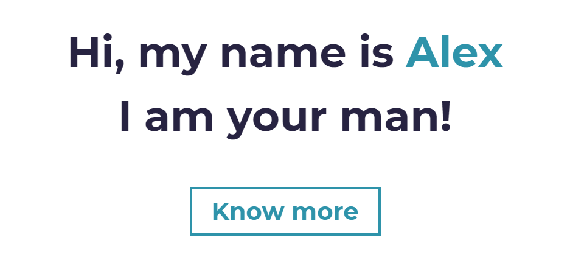

# A L E X A N D E R &nbsp;&nbsp; C H R I S T O P H

## P A P S T &nbsp;&nbsp; C H A K A

----

  

:point_up: CHECK OUT MY [`PORTFOLIO`](https://papstchaka.github.io/myportfolio/)!! :point_up:

There you can find all major projects I have done in the last years :smiley:

Also check out my other social media accounts:

- [`GitLab`](https://gitlab.com/papstchaka)
- [`E-Mail`](mailto:alexander.christoph@tum.de)
- [`LinkedIn`](https://www.linkedin.com/in/alex-christoph/)
- [`Xing`](https://www.xing.com/profile/Alexander_Christoph10)
- [`Instagram`](https://z-p42.www.instagram.com/papstchaka/)

----

  

- :man_student: I am studying at [`Technical University of Munich (TUM)`](https://www.tum.de/en/), even though I am right now in Vienna doing an Erasmus semester at [`Technical University of Vienna`](https://www.tuwien.at/en/)
- :computer: I am currently working for [`Siemens AG / Siemens Austria`](https://www.siemens.com/global/en.html) doing `Machine Learning` in industrial networks &rightarrow; check out [`FabOS`](https://www.fab-os.org/) to learn more about the project

<!-- https://www.webfx.com/tools/emoji-cheat-sheet/ -->